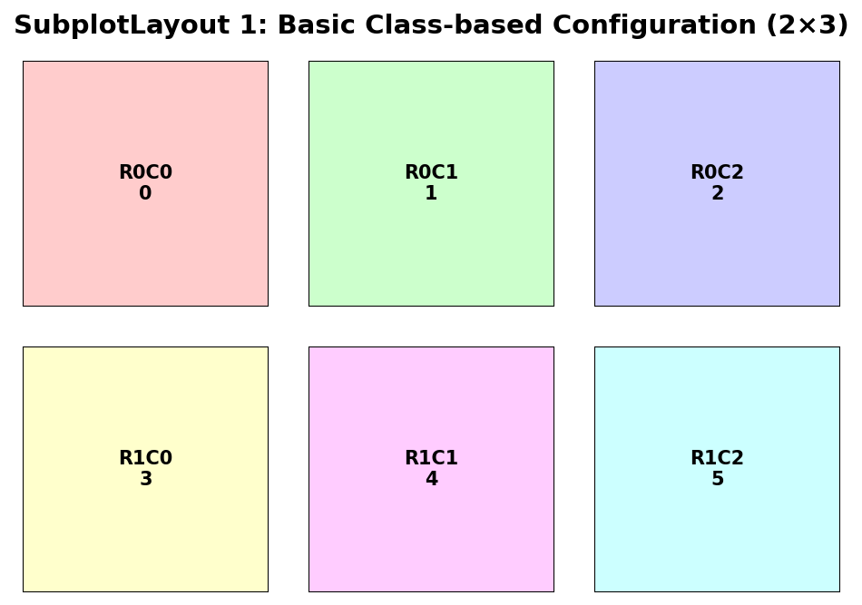
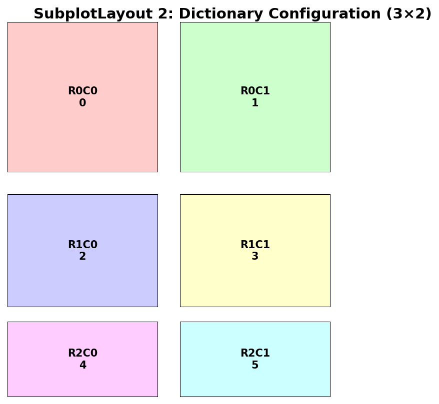
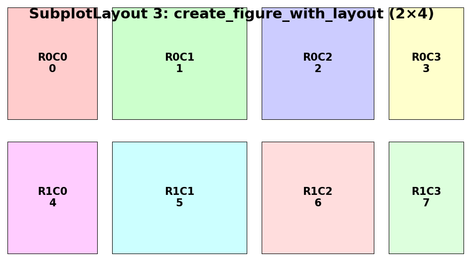
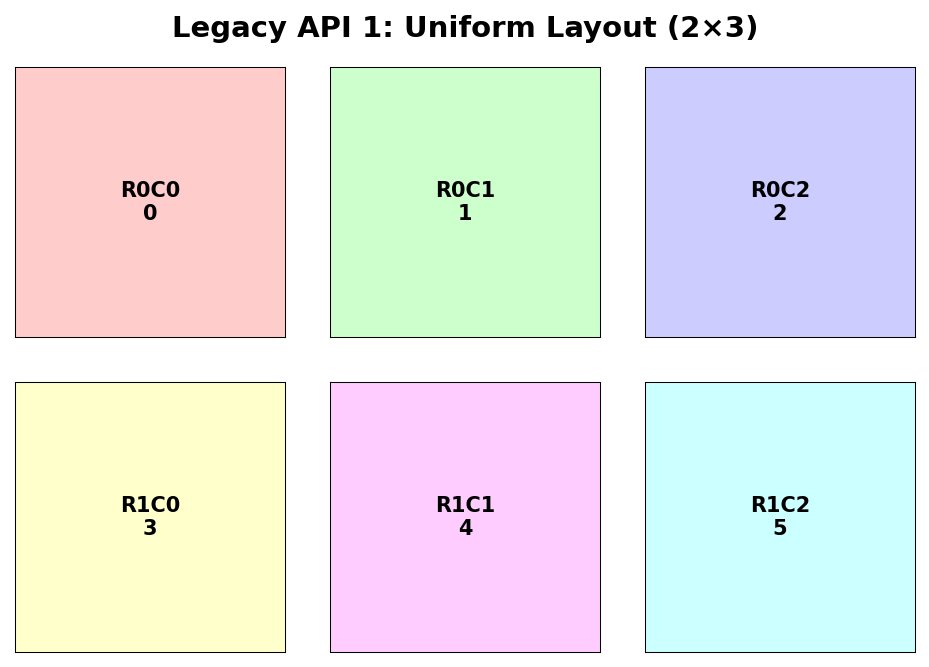
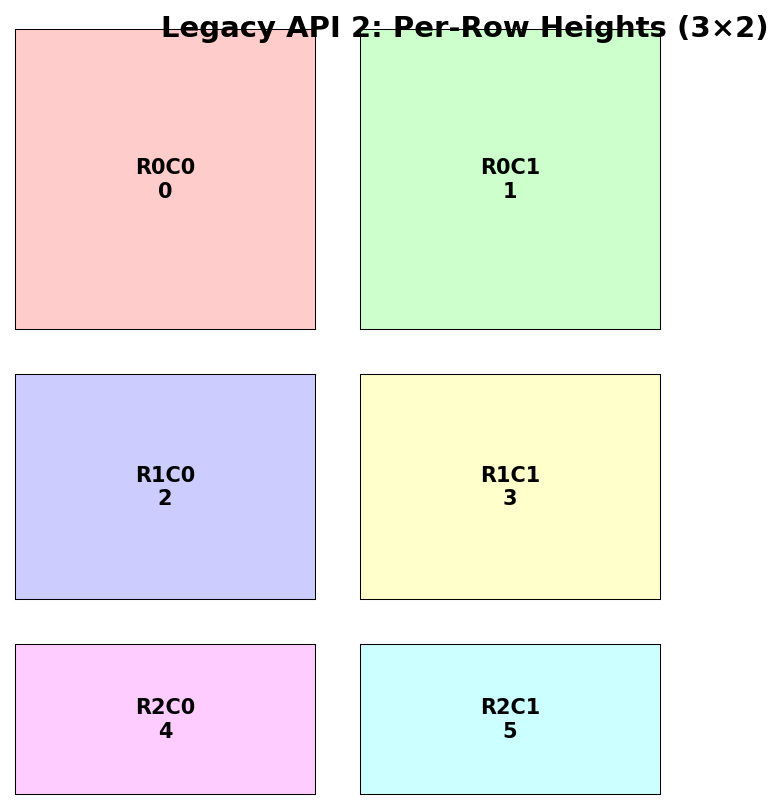
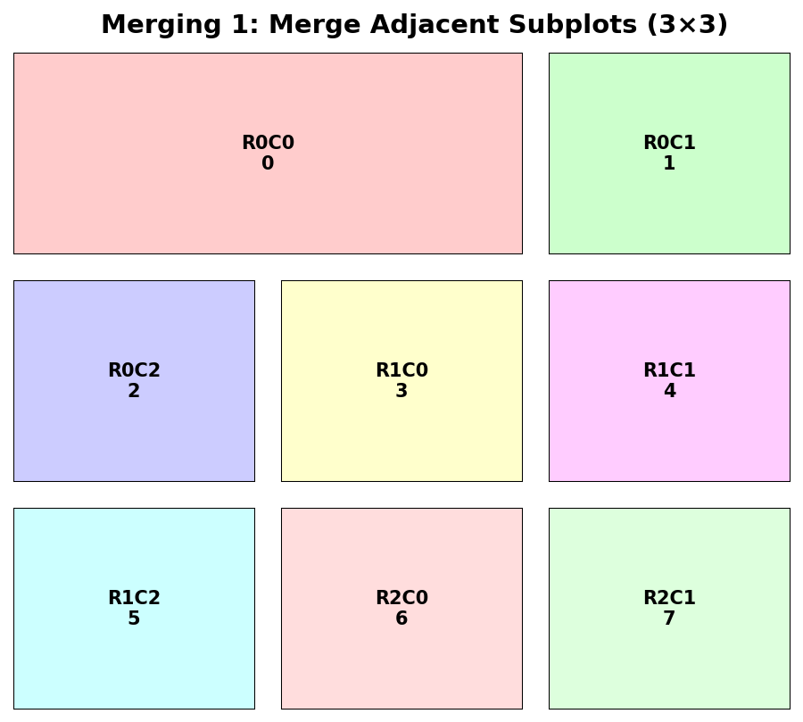
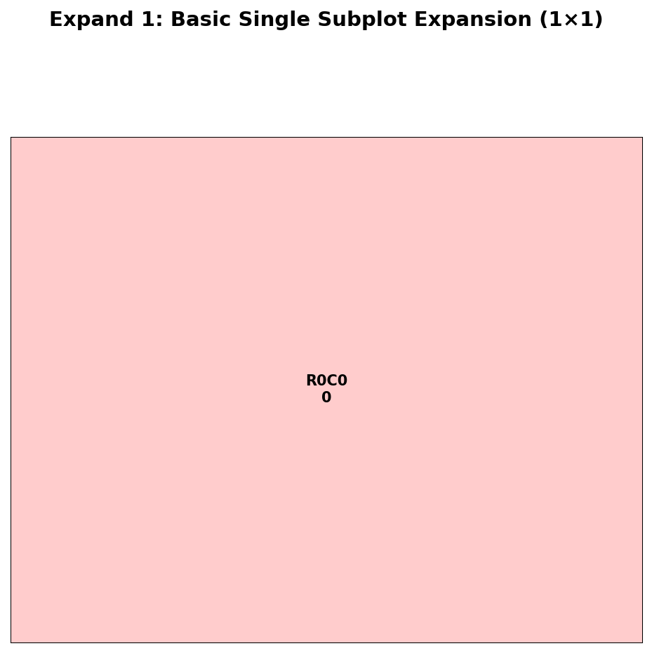
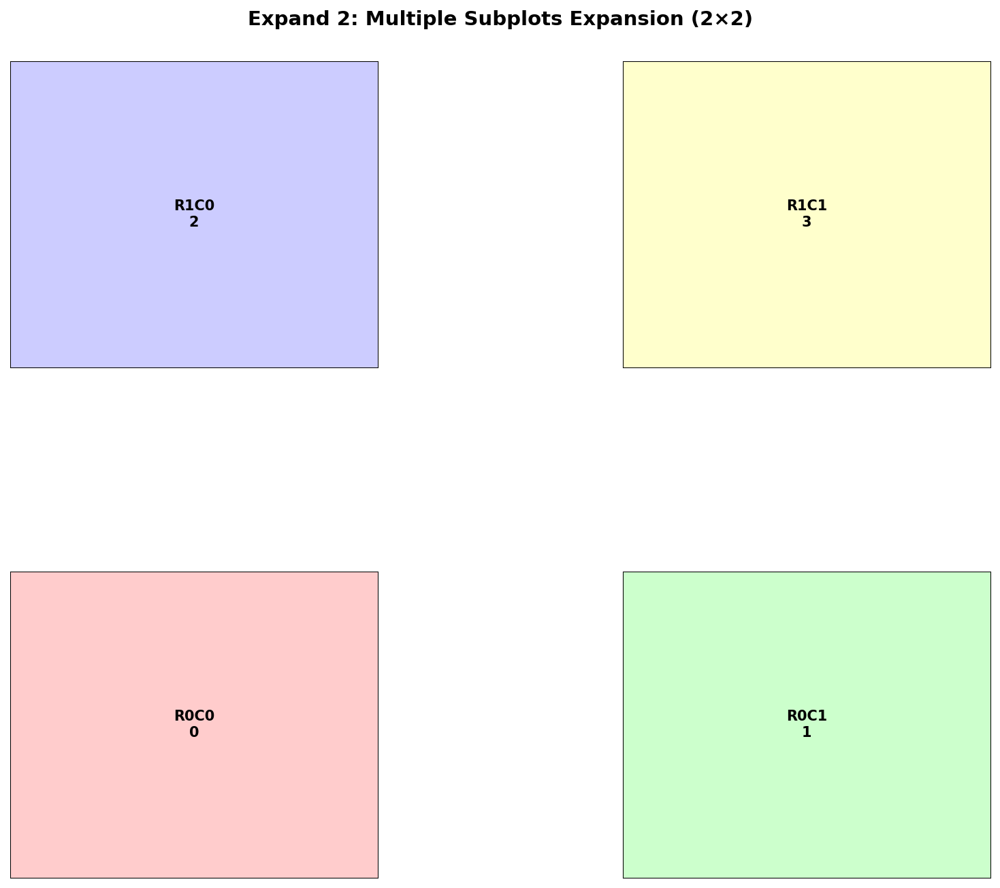

# yplot Documentation

This document provides comprehensive examples and guides for using yplot, a Python library for creating publication-quality scientific figures with precise subplot layouts.

## Table of Contents

1. [SubplotLayout System](#subplotlayout-system)
2. [Expand Subplot Coordinates](#expand-subplot-coordinates)
3. [Examples](#examples)
4. [API Reference](#api-reference)
5. [Migration Guide](#migration-guide)

## SubplotLayout System

The `SubplotLayout` class provides a unified interface for managing subplot configurations with support for:

- **Class-based configuration**: Direct parameter initialization
- **Dictionary configuration**: Load from Python dictionaries  
- **YAML file loading**: Load configurations from YAML files
- **Flexible configuration**: Supports multiple initialization methods

### Basic Usage

#### 1. Class-based Configuration

```python
from yplot.figure import SubplotLayout
from yplot.plotting import create_figure_with_layout

# Create a complete layout in one command
layout = SubplotLayout(
    fig_size_inches=(10, 8),
    rows=2,
    cols=3,
    row_heights=[3.0, 2.0],
    col_widths=[2.5, 2.5, 2.5],
    wspace=[0.5],
    hspace=[0.3, 0.3],
    margins={'left': 0.5, 'right': 0.5, 'top': 0.5, 'bottom': 0.5}
)

# Create figure
fig, axes = create_figure_with_layout(layout)
```

#### 2. Dictionary Configuration

```python
# Define layout as dictionary
config = {
    'fig_size': [12, 8],
    'rows': 2,
    'cols': 4,
    'row_heights': [3.0, 2.5],
    'col_widths': [2.0, 2.5, 2.0, 2.5],
    'wspace': [0.4],
    'hspace': [0.2, 0.3, 0.2],
    'margins': {
        'left': 0.5,
        'right': 0.5,
        'top': 0.5,
        'bottom': 0.5
    }
}

# Create figure using dictionary
fig, axes = create_figure_with_layout(config)
```

#### 3. YAML File Configuration

```yaml
# simple_layout.yaml
fig_size: [10, 8]
rows: 2
cols: 3
row_heights: [3.0, 2.0]
col_widths: [2.5, 2.5, 2.5]
wspace: [0.5]
hspace: [0.3, 0.3]
margins:
  left: 0.75
  right: 0.75
  top: 0.75
  bottom: 0.75
```

```python
# Load from YAML file
fig, axes = create_figure_with_layout('simple_layout.yaml')
```

## Expand Subplot Coordinates

The `expand_subplot_coordinates` function expands subplot coordinates to include margins and spacing around them. This is particularly useful when you want to insert a figure into a specific subplot position.

### Basic Usage

```python
from yplot.layout_utils import expand_subplot_coordinates

# Original subplot coordinate
coord = (0.2, 0.2, 0.6, 0.6)

# Expand it
expanded = expand_subplot_coordinates(
    coord, 
    fig_size_inches=(10, 8),
    margins={'left': 0.5, 'right': 0.5, 'top': 0.5, 'bottom': 0.5},
    spacing={'hspace': 0.3, 'wspace': 0.3}
)
```

## Examples

### SubplotLayout 1: Basic Class-based Configuration

Demonstrates the new SubplotLayout class with basic configuration.

#### Command

```python
layout = SubplotLayout(
    fig_size_inches=(7, 5),
    rows=2,
    cols=3,
    row_heights=[1.8, 1.8],
    col_widths=[1.8, 1.8, 1.8],
    wspace=[0.3],
    hspace=[0.3, 0.3],
    margins={'left': 0.5, 'right': 0.5, 'top': 0.5, 'bottom': 0.5}
)

coords = calculate_subplot_coordinates(layout)
```

#### Result



---

### SubplotLayout 2: Dictionary Configuration

Demonstrates SubplotLayout with dictionary configuration.

#### Command

```python
config = {
    'fig_size': [7, 6],
    'rows': 3,
    'cols': 2,
    'row_heights': [2.0, 1.5, 1.0],
    'col_widths': [2.0, 2.0],
    'wspace': [0.3, 0.2],
    'hspace': [0.3],
    'margins': {'left': 0.5, 'right': 0.5, 'top': 0.5, 'bottom': 0.5}
}

layout = SubplotLayout(config=config)
coords = calculate_subplot_coordinates(layout)
```

#### Result



---

### SubplotLayout 3: create_figure_with_layout

Demonstrates the new create_figure_with_layout function.

#### Command

```python
layout = SubplotLayout(
    fig_size_inches=(7, 4),
    rows=2,
    cols=4,
    row_heights=[1.5, 1.5],
    col_widths=[1.2, 1.8, 1.5, 1.0],
    wspace=[0.3],
    hspace=[0.2, 0.2, 0.2],
    margins={'left': 0.5, 'right': 0.5, 'top': 0.5, 'bottom': 0.5}
)

# Create figure and axes in one step
fig, axes = create_figure_with_layout(layout)
```

#### Result



---

### Legacy API 1: Uniform Layout

Demonstrates backward compatibility with uniform subplot sizing using SubplotLayout.

#### Command

```python
layout = SubplotLayout(
    fig_size_inches=(7, 5),
    rows=2,
    cols=3,
    row_heights=[1.8, 1.8],
    col_widths=[1.8, 1.8, 1.8],
    wspace=[0.3],
    hspace=[0.3, 0.3],
    margins={'left': 0.5, 'right': 0.5, 'top': 0.5, 'bottom': 0.5}
)

coords = calculate_subplot_coordinates(layout)
```

#### Result



---

### Legacy API 2: Per-Row Heights

Different subplot heights for each row using SubplotLayout.

#### Command

```python
layout = SubplotLayout(
    fig_size_inches=(7, 6),
    rows=3,
    cols=2,
    row_heights=[2.0, 1.5, 1.0],
    col_widths=[2.0, 2.0],
    hspace=[0.3],
    wspace=[0.3, 0.3],
    margins={'left': 0.5, 'right': 0.5, 'top': 0.5, 'bottom': 0.5}
)

coords = calculate_subplot_coordinates(layout)
```

#### Result



---

### Merging 1: Merge Adjacent Subplots

Merge adjacent subplots within a 3x3 grid to create larger subplots.

#### Command

```python
# Create 3x3 grid
layout = SubplotLayout(
    fig_size_inches=(7, 6),
    rows=3,
    cols=3,
    row_heights=[1.5, 1.5, 1.5],
    col_widths=[1.8, 1.8, 1.8],
    wspace=[0.2, 0.2],
    hspace=[0.2, 0.2],
    margins={'left': 0.5, 'right': 0.5, 'top': 0.5, 'bottom': 0.5}
)

coords = calculate_subplot_coordinates(layout)

# Merge subplots 0 and 1 (top row, first two)
merged_coords = merge_adjacent_subplots(coords, [(0, 1)])
# Result: 8 subplots, with subplot 0 being twice as wide
```

#### Result



---

### Expand 1: Basic Single Subplot Expansion

Expand a single subplot coordinate to include margins and spacing.

#### Command

```python
from yplot.layout_utils import expand_subplot_coordinates

# Original subplot coordinate
coord = (0.2, 0.2, 0.6, 0.6)

# Expand it
expanded = expand_subplot_coordinates(
    coord, 
    fig_size_inches=(10, 8),
    margins={'left': 0.5, 'right': 0.5, 'top': 0.5, 'bottom': 0.5},
    spacing={'hspace': 0.3, 'wspace': 0.3}
)

print(f"Original: {coord}")
print(f"Expanded: {expanded}")
```

#### Result



---

### Expand 2: Multiple Subplots Expansion

Expand multiple subplot coordinates simultaneously.

#### Command

```python
# Multiple subplot coordinates
coords = [
    (0.1, 0.1, 0.3, 0.3),  # Bottom left
    (0.6, 0.1, 0.3, 0.3),  # Bottom right
    (0.1, 0.6, 0.3, 0.3),  # Top left
    (0.6, 0.6, 0.3, 0.3)   # Top right
]

# Expand them
expanded_coords = expand_subplot_coordinates(
    coords,
    fig_size_inches=(12, 10),
    margins={'left': 0.75, 'right': 0.75, 'top': 0.75, 'bottom': 0.75},
    spacing={'hspace': 0.5, 'wspace': 0.5}
)
```

#### Result



---

## Summary

- **Total Examples**: 8
- **Successful**: 8
- **Failed**: 0

## Key Features Demonstrated

- ✅ **SubplotLayout Class**: Unified configuration with class, dictionary, and YAML support
- ✅ **create_figure_with_layout**: One-step figure and axes creation
- ✅ **YAML Configuration**: Load and save layouts from YAML files
- ✅ **Row-Based Dictionary Interface**: Intuitive row-by-row configuration
- ✅ **Backward Compatibility**: Original uniform API still works
- ✅ **Per-Row Heights**: Different subplot heights for each row
- ✅ **Per-Column Widths**: Different subplot widths for each column  
- ✅ **Variable Spacing**: Custom spacing between rows and columns
- ✅ **Subplot Merging**: Merge adjacent subplots or blocks
- ✅ **Coordinate Expansion**: Expand coordinates for figure insertion
- ✅ **Visual Validation**: Each figure shows row/column indexing

## Tips and Best Practices

1. **Use SubplotLayout class** for new projects - it's the recommended approach
2. **Try YAML configuration** for easy layout management and sharing
3. **Use create_figure_with_layout** for one-step figure creation
4. **Start with uniform layouts** for simple cases
5. **Use per-row customization** when you need different subplot sizes
6. **Use the row dictionary interface** for complex layouts with varying column counts
7. **Mix uniform and per-row** specifications as needed
8. **Check figure size requirements** - the function warns if subplots don't fit
9. **Use lists for spacing** to create visual grouping between subplots
10. **Use expand_subplot_coordinates** for figure insertion scenarios

